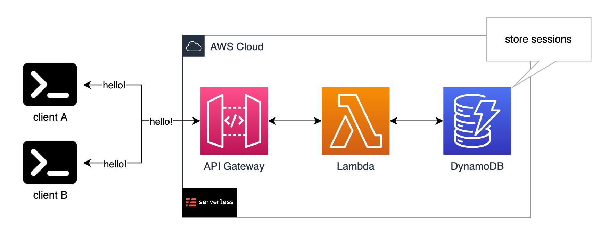
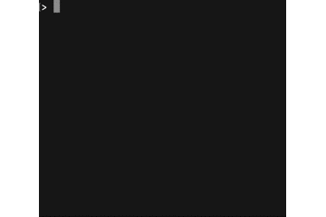

# Serverless Websocket

simple serverless websocket server with `Lambda` and `DynamoDB`





<br>

# Requirements

installed `Serverless Framework`

```bash
$ npm install -g serverless
```

<br>

# Setup

### aws setting

```bash
$ export AWS_ACCESS_KEY_ID=<your_access_key_id>
$ export AWS_SECRET_ACCESS_KEY=<your_secret_access_key>

# confirm and get your account id
$ aws sts get-caller-identity --query Account --output text

# create .env
$ echo "AWS_ACCOUNT_ID=<your_account_id>" > .env
```

### deploy

```bash
# build
$ make build

# deploy
$ make deploy

# remove
$ make remove
```

<br>

# Test

test with `wscat`

```bash
# install wscat
$ npm install -g wscat

# get connection and try to send some messages
$ wscat -c wss://<your_apigateway_id>.execute-api.ap-northeast-1.amazonaws.com/dev
```
